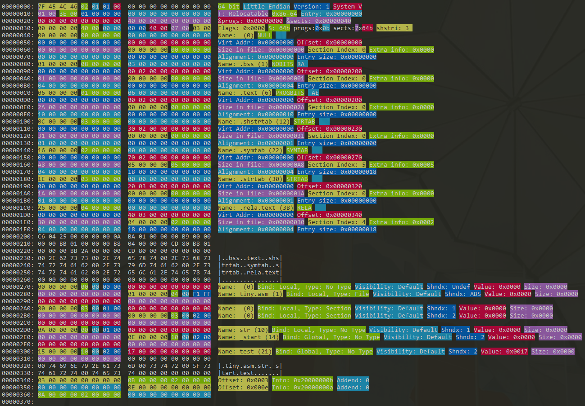

Elf Edit
========

A simple hex editing tool with highlighting and human readable form on the sidebar for ELF (Executable and linking format) files.



If you trust me you can get a Linux binary from the [releases](https://github.com/TheThirdOne/elf-edit/releases).

## Istallation

Before attempting to install this, you'll need to have cargo and rust installed, but with that done, it should be a simple install.

```
git clone https://github.com/TheThirdOne/elf-edit/
cd elf-edit
cargo install
cargo run fileToInspect
```